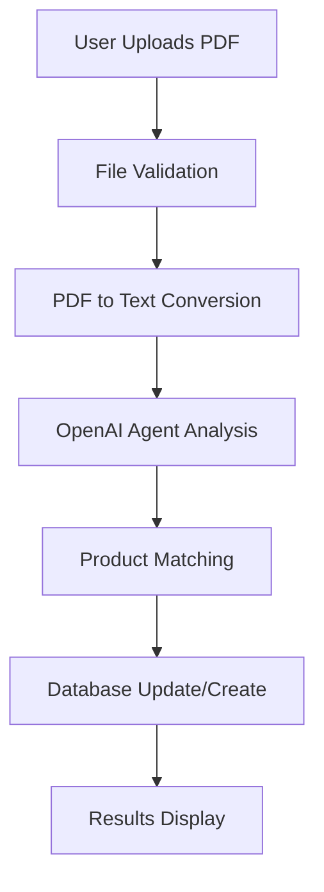

# AI Agent System for PDF Technical Document Conversion

## Overview

This document provides a comprehensive explanation of the AI Agent system designed to extract information from SpecChem's Technical Data Sheets (TDS) and Safety Data Sheets (SDS) in PDF format and populate the Supabase database. The system is built using OpenAI's Agent Builder and integrated with ChatKit for deployment, following a structured workflow without custom prompts in API routes.

## System Architecture

### Core Components

1. **PDF Extraction Chatbot** (`PDFExtractionChatbot.tsx`)
   - User interface for uploading PDF documents
   - Real-time processing feedback
   - Results display and interaction

2. **API Routes**
   - `/api/pdf-extract/upload` - Handles PDF file uploads
   - `/api/pdf-extract/process` - Processes PDFs with OpenAI Agent Builder

3. **Database Integration**
   - Supabase client for database operations
   - Product matching and update logic
   - Pictogram association management

4. **Agent Builder Integration**
   - OpenAI GPT-4o model for content analysis
   - Structured JSON response schema
   - Confidence scoring and quality assessment

## Workflow Process

### 1. Document Upload and Processing



**Step-by-Step Process:**

1. **File Upload** (`/api/pdf-extract/upload/route.ts`)
   - Validates PDF file type and size (10MB limit)
   - Generates unique filename with UUID
   - Saves to `/uploads` directory
   - Returns file path for processing

2. **PDF Text Extraction** (`/api/pdf-extract/process/route.ts`)
   - Uses `pdftotext` command-line tool
   - Converts PDF to plain text
   - Validates text extraction success

3. **AI Analysis** (OpenAI Agent Builder)
   - Sends text to GPT-4o model
   - Uses structured prompt for data extraction
   - Returns JSON with extracted data and metadata

### 2. Product Matching Logic

The system implements a sophisticated product matching strategy:

#### Matching Strategies (in order of preference):

1. **Exact Name Match**
   ```sql
   SELECT * FROM products WHERE name = 'extracted_name'
   ```

2. **Slug Match**
   ```sql
   SELECT * FROM products WHERE slug = 'generated_slug'
   ```

3. **Case-Insensitive Match**
   ```sql
   SELECT * FROM products WHERE name ILIKE 'extracted_name'
   ```

4. **Partial Match**
   ```sql
   SELECT * FROM products WHERE name ILIKE '%extracted_name%'
   ```

#### Product Matching Confidence Levels:

- **Exact**: Perfect name match
- **High**: Fuzzy match with >80% confidence
- **Medium**: Partial match with 60-80% confidence
- **Low**: Weak match with <60% confidence
- **None**: No match found

### 3. Data Extraction Schema

The Agent Builder uses a comprehensive JSON schema for data extraction:

```json
{
  "metadata": {
    "document_type": "TDS" | "SDS" | "BOTH" | "UNKNOWN",
    "product_name_extracted": "string",
    "extraction_confidence": "high" | "medium" | "low",
    "document_quality": "excellent" | "good" | "fair" | "poor",
    "flags": {
      "needs_manual_review": boolean,
      "has_ambiguities": boolean,
      "missing_critical_data": boolean
    }
  },
  "product_match": {
    "existing_product_id": "string" | null,
    "match_confidence": "exact" | "high" | "medium" | "low" | "none",
    "match_method": "name_exact" | "name_fuzzy" | "sku_match" | "slug_match",
    "action_required": "update" | "create" | "review" | "skip"
  },
  "extracted_data": {
    "product": { /* Product fields */ },
    "pictograms": [ /* Safety pictograms */ ],
    "category": { /* Product category */ }
  }
}
```

## Handling Existing Products with Incomplete Data

### Update Strategy

When a product exists but has incomplete fields, the system follows this approach:

1. **Field Comparison**
   - Compares extracted data with existing database entries
   - Identifies missing or incomplete fields
   - Preserves existing data unless new data is more complete

2. **Selective Updates**
   - Only updates fields with meaningful new data
   - Skips empty values and placeholder text
   - Maintains data integrity

3. **Update Logic** (from `scripts/import-sds-to-database.mjs`):
   ```javascript
   const fieldsToUpdate = [
     'signal_word',
     'hazard_statements', 
     'precautionary_statements',
     'response_statements',
     'components_determining_hazard',
     'first_aid',
     'storage',
     'disposal',
     'proper_shipping_name',
     'hazard_class',
     'packing_group'
   ];
   ```

4. **Data Validation**
   - Filters out empty values
   - Removes placeholder text ("NONE", "Not applicable")
   - Ensures minimum data quality thresholds

### Database Schema Integration

The system works with a comprehensive database schema:

#### Core Tables:

1. **products** - Main product information
2. **categories** - Product categorization
3. **pictograms** - Safety pictogram library (22 GHS pictograms)
4. **product_pictograms** - Many-to-many relationship

#### Key Product Fields:

- **Identification**: `name`, `slug`, `sku`, `category_id`
- **Descriptions**: Multi-language support (English, French, Spanish)
- **Technical Data**: `application`, `features`, `coverage`, `limitations`
- **Safety Information**: `signal_word`, `hazard_statements`, `precautionary_statements`
- **Transportation**: `proper_shipping_name`, `un_number`, `hazard_class`
- **Special Flags**: `do_not_freeze`, `mix_well`, `green_conscious`

## Safety Pictogram Processing

### Pictogram Identification

The system identifies applicable GHS pictograms based on hazard information:

1. **Hazard Analysis**
   - Analyzes signal words and hazard statements
   - Maps hazards to standard pictogram categories
   - Assigns confidence levels to pictogram matches

2. **Pictogram Mapping**
   ```javascript
   const pictogramMappings = {
     'flammable': 'ghs02',
     'corrosive': 'ghs05', 
     'toxic': 'ghs06',
     'environmental-hazard': 'ghs09',
     'explosive': 'ghs01',
     'oxidizing': 'ghs03'
   };
   ```

3. **Database Association**
   - Creates entries in `product_pictograms` table
   - Links products to applicable pictograms
   - Maintains relationship integrity

## Error Handling and Quality Control

### Data Quality Checks

1. **Validation Rules**
   - Required fields must be populated
   - Signal words must match hazard statements
   - Pictogram assignments must be appropriate
   - Data consistency between TDS and SDS

2. **Confidence Scoring**
   - High confidence: Clear, unambiguous data
   - Medium confidence: Some uncertainty
   - Low confidence: Ambiguous or conflicting data

3. **Manual Review Flags**
   - `needs_manual_review`: Complex or ambiguous cases
   - `has_ambiguities`: Conflicting information detected
   - `missing_critical_data`: Essential safety data missing

### Error Recovery

1. **Graceful Degradation**
   - Continues processing with available data
   - Flags issues for manual review
   - Preserves original text when mapping unclear

2. **Logging and Monitoring**
   - Comprehensive error logging
   - Processing statistics tracking
   - Performance monitoring

## Current System Status

### Operational Features

✅ **Fully Functional**
- PDF upload and processing
- AI-powered data extraction
- Product matching and updates
- Safety pictogram processing
- Real-time user feedback

✅ **Database Integration**
- Supabase client integration
- Product CRUD operations
- Pictogram associations
- Multi-language support

✅ **User Interface**
- Intuitive chat-based interface
- Progress tracking
- Results display
- Error handling

### Performance Characteristics

- **Processing Time**: 10-30 seconds per PDF
- **File Size Limit**: 10MB maximum
- **Supported Formats**: PDF only
- **Accuracy**: High confidence for structured documents

## Optimization Opportunities

### Immediate Improvements

1. **User Visibility Enhancement**
   - Display extracted data before database write
   - Allow user review and editing
   - Provide copy-to-clipboard functionality

2. **Batch Processing**
   - Support multiple PDF uploads
   - Queue-based processing
   - Progress tracking for batches

3. **Enhanced Feedback**
   - Detailed extraction summaries
   - Confidence indicators per field
   - Suggested corrections

### Advanced Optimizations

1. **Machine Learning Integration**
   - Learn from user corrections
   - Improve extraction accuracy over time
   - Pattern recognition for document types

2. **Performance Optimization**
   - Caching for repeated documents
   - Parallel processing capabilities
   - Optimized database queries

3. **Integration Enhancements**
   - API endpoints for external systems
   - Webhook notifications
   - Export capabilities

## Technical Implementation Details

### API Endpoints

#### Upload Endpoint (`/api/pdf-extract/upload`)
```typescript
POST /api/pdf-extract/upload
Content-Type: multipart/form-data

Response:
{
  "success": true,
  "fileName": "uuid-original-name.pdf",
  "filePath": "/uploads/uuid-original-name.pdf",
  "fileSize": 1024000,
  "originalName": "product-sds.pdf"
}
```

#### Process Endpoint (`/api/pdf-extract/process`)
```typescript
POST /api/pdf-extract/process
Content-Type: application/json

Request:
{
  "filePath": "/uploads/uuid-original-name.pdf",
  "fileName": "product-sds.pdf"
}

Response:
{
  "metadata": { /* extraction metadata */ },
  "product_match": { /* matching results */ },
  "extracted_data": { /* structured data */ },
  "extraction_notes": { /* quality assessment */ },
  "recommended_actions": [ /* suggested next steps */ ]
}
```

### Database Operations

#### Product Matching Query
```sql
-- Multi-strategy product matching
WITH product_matches AS (
  -- Strategy 1: Exact match
  SELECT id, name, 'exact' as match_type, 1.0 as confidence
  FROM products 
  WHERE name = $1
  
  UNION ALL
  
  -- Strategy 2: Case-insensitive match
  SELECT id, name, 'case_insensitive' as match_type, 0.9 as confidence
  FROM products 
  WHERE name ILIKE $1
  
  UNION ALL
  
  -- Strategy 3: Partial match
  SELECT id, name, 'partial' as match_type, 0.7 as confidence
  FROM products 
  WHERE name ILIKE '%' || $1 || '%'
)
SELECT * FROM product_matches 
ORDER BY confidence DESC 
LIMIT 1;
```

#### Product Update Query
```sql
UPDATE products 
SET 
  signal_word = COALESCE($2, signal_word),
  hazard_statements = COALESCE($3, hazard_statements),
  precautionary_statements = COALESCE($4, precautionary_statements),
  -- ... other fields
  updated_at = CURRENT_TIMESTAMP
WHERE id = $1
RETURNING *;
```

## Maintenance and Monitoring

### Logging Strategy

1. **Processing Logs**
   - File upload events
   - Extraction results
   - Database operations
   - Error conditions

2. **Performance Metrics**
   - Processing times
   - Success rates
   - Confidence distributions
   - User interactions

3. **Quality Metrics**
   - Extraction accuracy
   - Manual review rates
   - User corrections
   - System improvements

### Monitoring Dashboard

Recommended monitoring points:

- **System Health**: API response times, error rates
- **Processing Volume**: Documents processed per day
- **Quality Metrics**: Confidence scores, review rates
- **User Engagement**: Upload frequency, interaction patterns

## Future Development Roadmap

### Phase 1: User Experience Enhancements
- [ ] Pre-write data review interface
- [ ] Copy-to-clipboard functionality
- [ ] Batch processing support
- [ ] Enhanced error messages

### Phase 2: System Optimization
- [ ] Performance monitoring dashboard
- [ ] Caching implementation
- [ ] Parallel processing
- [ ] API rate limiting

### Phase 3: Advanced Features
- [ ] Machine learning integration
- [ ] Document type auto-detection
- [ ] Multi-language extraction
- [ ] Integration APIs

### Phase 4: Enterprise Features
- [ ] User management
- [ ] Audit logging
- [ ] Compliance reporting
- [ ] Advanced analytics

## Conclusion

The AI Agent system represents a sophisticated solution for automated PDF data extraction and database population. Built on OpenAI's Agent Builder with ChatKit integration, it provides accurate, reliable processing of technical documents while maintaining data integrity and user control.

The system's strength lies in its structured approach to data extraction, comprehensive product matching logic, and robust error handling. With ongoing optimization and user feedback integration, it will continue to improve in accuracy and efficiency.

Key success factors:
- **Structured Data Extraction**: Consistent JSON schema ensures reliable data mapping
- **Intelligent Product Matching**: Multi-strategy approach handles various naming conventions
- **Quality Control**: Confidence scoring and manual review flags maintain data integrity
- **User-Centric Design**: Real-time feedback and intuitive interface enhance user experience

The system is ready for production use and positioned for continued enhancement based on user needs and technological advances.
